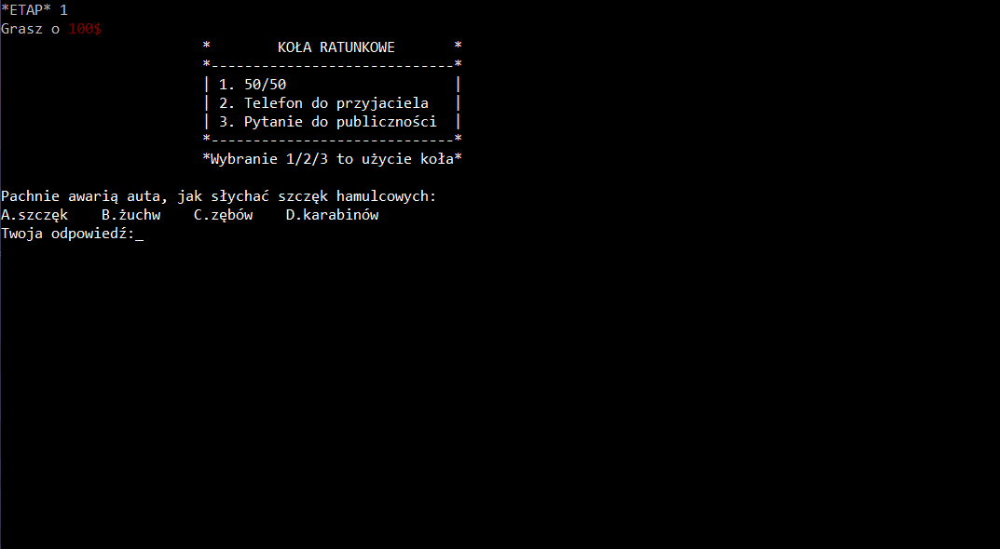

# Milionerzy
Aplikacja symulująca grę Milionerzy.

## Jak grać

***

***

Celem gry jest podanie poprawnej odpowiedzi w każdym z 15 etapów i zostanie milionerem.   
Każdemu etapowi odpowiada jedno pytanie do którego musimy dopasować jedną z 4 odpowiedzi.  
W wyborze odpowiedzi pomóc nam mogą 3 koła ratunkowe.  

* 50/50
    * odrzuca 2 błędne odpowiedzi 
* Telefon do przyjaciela
    * prosimy o pomoc naszego przyjaciela
* Pytanie do publiczności
    * pozwala zobaczyć na jaką odpowiedź stawia publiczność

Gracz podając odpowiedź ma 7 opcji.

* 'A' - uznanie pierwszej od lewej odpowiedzi za poprawną
* 'B' - uznanie drugiej od lewej odpowiedzi za poprawną
* 'C' - uznanie trzeciej od lewej odpowiedzi za poprawną
* 'D' - uznanie czwartej od lewej odpowiedzi za poprawną
* '1' - użycie koła ratunkowego "50/50"
    * możliwe tylko raz na grę
* '2' - użycie koła ratunkowego "Telefon do przyjaciela"
    * możliwe tylko raz na grę
* '3' - użycie koła ratunkowego "Pytanie do publicznośći"
    * możliwe tylko raz na grę

## Struktura plików aplikacji

* build.../ - ** Tworzony tylko po kompilacji projektu **
* bin/ - Ostatnio skompilowany plik wykonywalny
* doc/ - Pliki używane do dokumentacji projektu
* data/ - Dane używane w aplikacji
* src/ - Pliki źródłowe oraz nagłówkowe

## Narzędzia użyte przy tworzeniu projektu
**Języki**

* C++
    * Logika i interfejs aplikacji
* Python - _numpy_, _pandas_
    * Tworzenie oraz edycja plików z pytaniami .csv

**Narzędzia**

* Środowisko Qt Creator
    * MSVC 2019 compiler
    * CDB debugger
* System kontroli wersji GIT
* Zdalne repozytorium BitBucket

## Twórcy oraz podział obowiązków
|Dawid Wołek|Jakub Kaczocha|
|-----------|--------------|
|- 7 plików .csv|- 8 plików .csv|
|- Wczytywanie pytań z plików .csv|- Wyswietlanie pytania|
|- Obsługa błędów wczytywanych danych|- Wyświetlanie odpowiedzi|
|- Koło ratunkowe 50/50|- Wybór odpowiedzi|
|- Logika związana z blokowaniem kół w grze i danych etapach|- Weryfikacja odpowiedzi, zabezpieczanie wejścia użytkownika|
|- Interfejs kół ratunkowych|- Telefon do przyjaciela|
|- Ujednolicenie kodu i struktury plików projketu|- Pytanie do publiczności|
|- Struktura README|- Szkielet gry na etapie bez kół ratunkowych|

